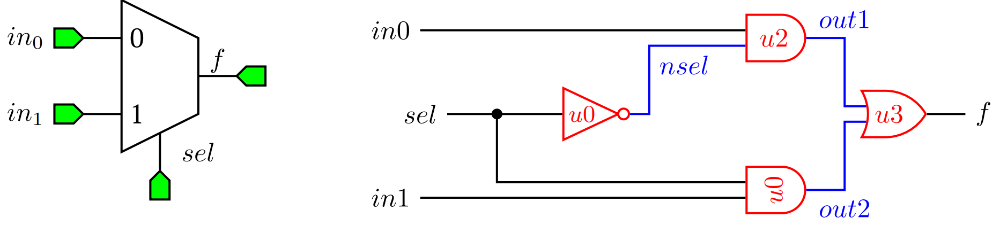

On System Verilog Modules
=========================

*"module"* is the basic unit (block) of hierarchy in SystemVerilog and they can be reused to create other modules in hierarchical manner. The module describes the boundaries, inputs and outputs, and the functionality of the circuit block being modelled. To explain the concept of the module, a multiplexor circuit is modelled based on its gate level schematic. 

Multiplexer is a combinational logic circuit which outputs the data coming from one of its inputs as defined by the value of its selection signal. For example, a two input MUX has two data inputs (in0,in1) and a selector input (sel), and it has only one output (f ) (refer Figure 1 for the circuit).

   Two input multiplexor symbol and its gate level schematic

.. code-block:: 
   :caption: CaptionHere

   module mux2gate(f, in0, in1, sel);
   // this is a comment
	   output logic  f;
	   input logic in0, in1, sel;
	   logic out1,nsel,out2; 

      /* This is a multi line 
      comment */

	   and u0 (out1,in1,sel); // <module type> <instance name> 
	   not u2 (nsel, sel); 
	   and u1 (out2,nsel,in0);
	   or u3 (f,out1,out2);
   endmodule: mux2gate
